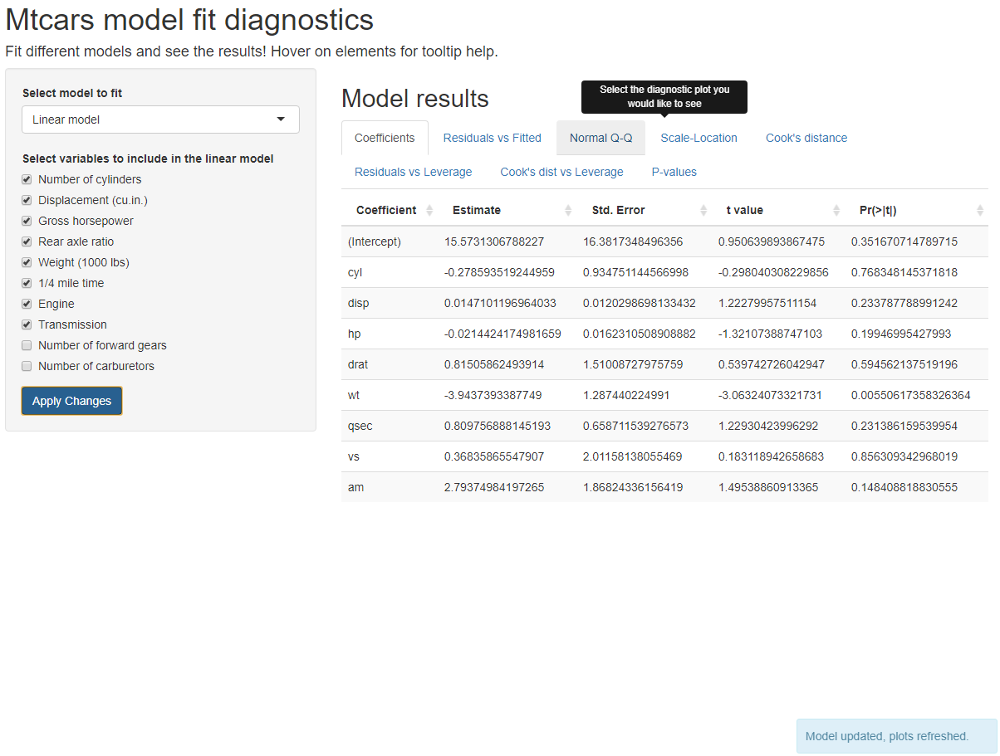

Mtcars model fit diagnostics
========================================================
author: Sebastian Rodriguez
date: 11-04-2020
autosize: true
transition: rotate
width: 1920
height: 1080
css: style.css

Motivation
========================================================

- Comparing different models is time consuming in the R console/R studio

- Plots can be seen one at a time and need to be redrawn to look at them again

- Getting all the summary data required to compare models requires multiple commands

- Changing predictors or models means that the entire code must be re-run from the start

- Repeated testing becomes repetitive and tedious

<div class="footer"><div class="name">Mtcars model fit diagnostics</div><div class="number">2/5</div></div>

Solution, create an app!
========================================================
left: 30%

<div class="footer"><div class="name">Mtcars model fit diagnostics</div><div class="number">3/5</div></div>

Automate the work by creating a shiny app:

- Easily change model and parameters using input widgets
- Quickly swap between the resulting coefficients and diagnostic plots using tabs
- Correctly handle and report errors when provided invalid input (no predictor selected)

***



Case study: mtcars dataset
========================================================

We demo the app using the well-known mtcars dataset:

<div class="footer"><div class="name">Mtcars model fit diagnostics</div><div class="number">4/5</div></div>

- We attempt to fit multiple models (linear and generalized linear) using the formula $mpg \sim .$
- The resulting fit p-values may be significant or not depending on the predictors used
- Many predictors are highly correlated (see plot on the right)
- We can see how predictors interact with each other quickly using the app!
- Many predictors create many possible combinations to test

```r
dim(mtcars)
```

```
[1] 32 11
```

***


```r
ggpairs(mtcars)
```


Conclusion
========================================================

- The Shiny app greatly simplifies the comparison between models and predictors by 
conveniently presenting all plots and data in a comfortable tabbed view

- Significant speedup compared to interactive testing using the R console!

- Can quickly compare plots back to back by changing tabs

- The app solves all the problems raised at the start of the presentation by automating the model training and diagnostic plot generation while providing interactivity

- Can quickly test the impact of using different predictors

- Fast implementation with minimal use of resources


<div class="footer"><div class="name">Mtcars model fit diagnostics</div><div class="number">5/5</div></div>
